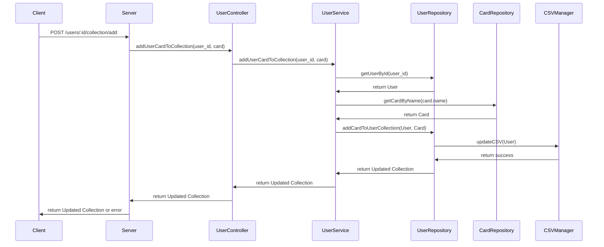

Here's a mermaid.js sequence diagram for the "Add Card to Collection" use case:

This sequence diagram illustrates the flow of the "Add Card to Collection" use case using the provided classes and parameters. The diagram starts with the client making a POST request to the server, and ends with the server returning the updated card collection or an error.