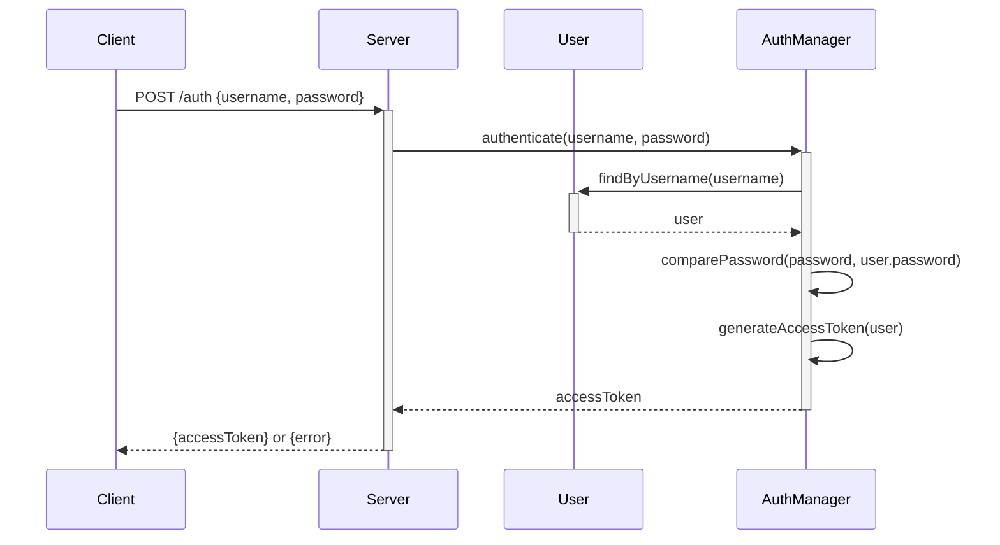

This sequence diagram illustrates the flow of the "Authenticate User" use case using mermaid.js in markdown format. The client sends a POST request to the server with the username and password. The server then calls the authenticate method in the AuthManager class, which finds the user by the username and compares the provided password with the stored password. If the authentication is successful, an access token is generated and returned to the client. Otherwise, an error is returned.