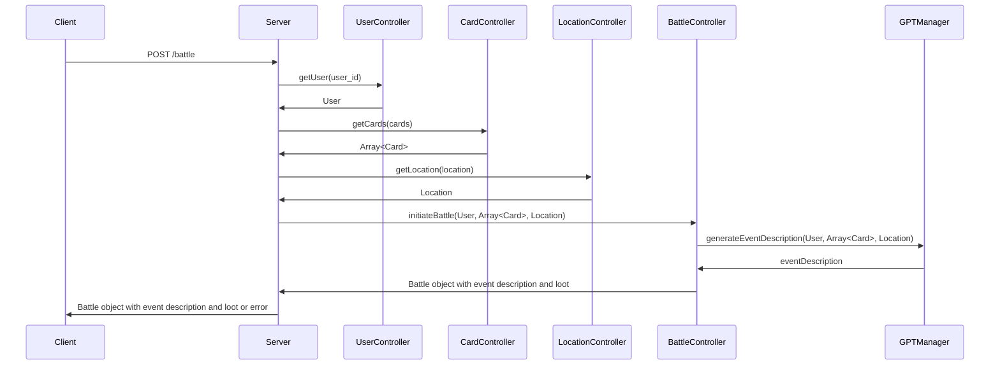

```mermaid
sequenceDiagram
    participant Client
    participant Server
    participant UserController
    participant CardController
    participant LocationController
    participant BattleController
    participant GPTManager

    Client->>Server: POST /battle
    Server->>UserController: getUser(user_id)
    UserController->>Server: User
    Server->>CardController: getCards(cards)
    CardController->>Server: Array<Card>
    Server->>LocationController: getLocation(location)
    LocationController->>Server: Location
    Server->>BattleController: initiateBattle(User, Array<Card>, Location)
    BattleController->>GPTManager: generateEventDescription(User, Array<Card>, Location)
    GPTManager->>BattleController: eventDescription
    BattleController->>Server: Battle object with event description and loot
    Server->>Client: Battle object with event description and loot or error
```
This sequence diagram represents the flow of the RESTful Use Case for initiating a battle event with selected cards and location. The diagram is created using mermaid.js in markdown format.