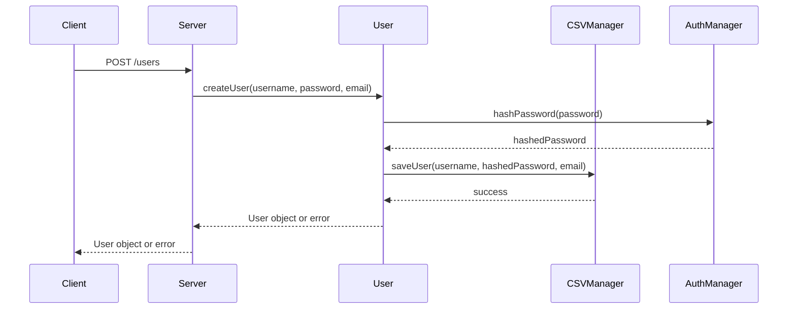

```mermaid
sequenceDiagram
participant Client
participant Server
participant User
participant CSVManager
participant AuthManager

Client->>Server: POST /users
Server->>User: createUser(username, password, email)
User->>AuthManager: hashPassword(password)
AuthManager-->>User: hashedPassword
User->>CSVManager: saveUser(username, hashedPassword, email)
CSVManager-->>User: success
User-->>Server: User object or error
Server-->>Client: User object or error
```
```