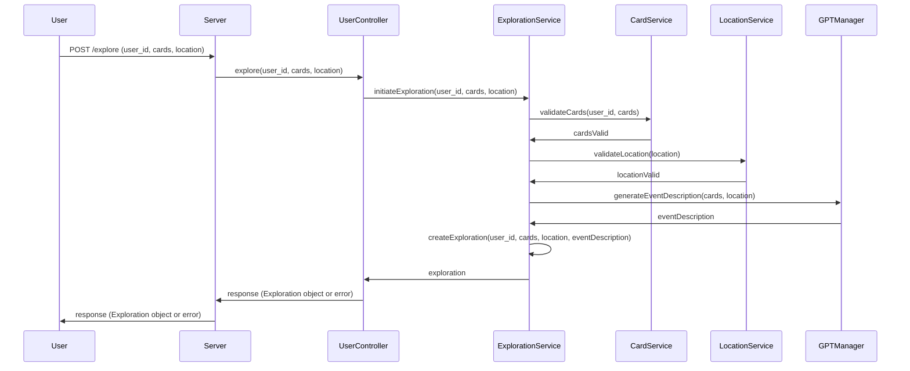

This sequence diagram represents the flow of the "Explore Location" RESTful use case, using the mermaid.js syntax in Markdown format. It shows how the User interacts with the Server, which in turn calls various classes and services to validate cards and locations, generate event descriptions, and create an Exploration object.