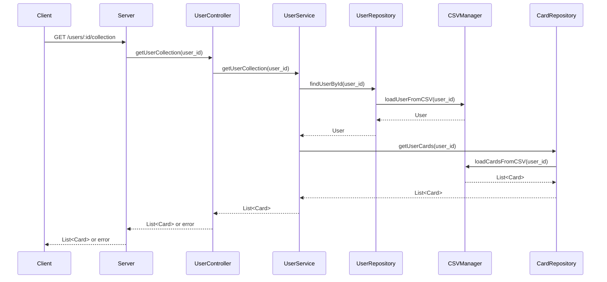

Here's the mermaid.js sequence diagram for the given RESTful Use Case:

This diagram shows the flow of the request from the client to the server, and then through the different layers of the application (Controller, Service, Repository, and CSVManager). The response with the list of Card objects or error is then sent back to the client.