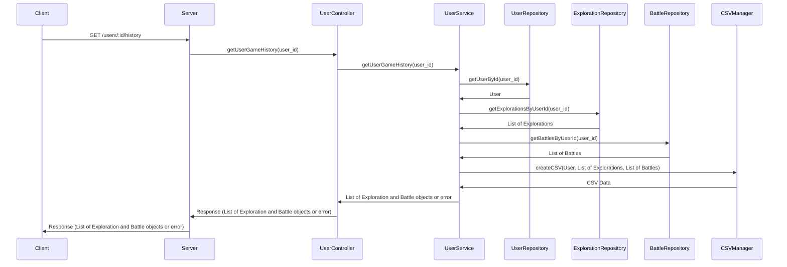

This sequence diagram represents the flow of the "Get User Game History" use case using the mermaid.js markdown format. It shows the interaction between the client, server, and various classes involved in retrieving the user's game history of explorations and battles.