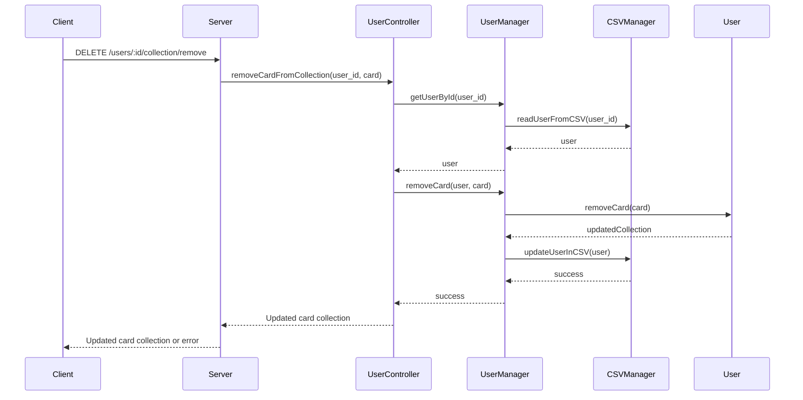

```mermaid
sequenceDiagram
    participant Client
    participant Server
    participant UserController
    participant UserManager
    participant CSVManager

    Client->>Server: DELETE /users/:id/collection/remove
    Server->>UserController: removeCardFromCollection(user_id, card)
    UserController->>UserManager: getUserById(user_id)
    UserManager->>CSVManager: readUserFromCSV(user_id)
    CSVManager-->>UserManager: user
    UserManager-->>UserController: user
    UserController->>UserManager: removeCard(user, card)
    UserManager->>User: removeCard(card)
    User-->>UserManager: updatedCollection
    UserManager->>CSVManager: updateUserInCSV(user)
    CSVManager-->>UserManager: success
    UserManager-->>UserController: success
    UserController-->>Server: Updated card collection
    Server-->>Client: Updated card collection or error
```
This sequence diagram illustrates the interactions between the Client, Server, UserController, UserManager, User, and CSVManager classes for the "Remove Card from Collection" use case.