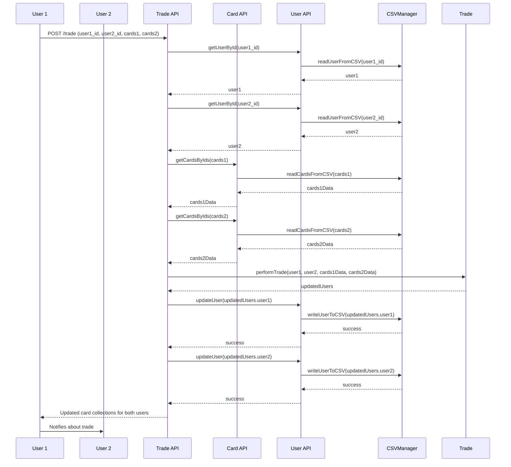

```mermaid
sequenceDiagram
    participant User1 as User 1
    participant User2 as User 2
    participant TradeApi as Trade API
    participant CardApi as Card API
    participant UserApi as User API
    participant CSVManager

    User1->>TradeApi: POST /trade (user1_id, user2_id, cards1, cards2)
    TradeApi->>UserApi: getUserById(user1_id)
    UserApi->>CSVManager: readUserFromCSV(user1_id)
    CSVManager-->>UserApi: user1
    UserApi-->>TradeApi: user1
    TradeApi->>UserApi: getUserById(user2_id)
    UserApi->>CSVManager: readUserFromCSV(user2_id)
    CSVManager-->>UserApi: user2
    UserApi-->>TradeApi: user2
    TradeApi->>CardApi: getCardsByIds(cards1)
    CardApi->>CSVManager: readCardsFromCSV(cards1)
    CSVManager-->>CardApi: cards1Data
    CardApi-->>TradeApi: cards1Data
    TradeApi->>CardApi: getCardsByIds(cards2)
    CardApi->>CSVManager: readCardsFromCSV(cards2)
    CSVManager-->>CardApi: cards2Data
    CardApi-->>TradeApi: cards2Data
    TradeApi->>Trade: performTrade(user1, user2, cards1Data, cards2Data)
    Trade-->>TradeApi: updatedUsers
    TradeApi->>UserApi: updateUser(updatedUsers.user1)
    UserApi->>CSVManager: writeUserToCSV(updatedUsers.user1)
    CSVManager-->>UserApi: success
    UserApi-->>TradeApi: success
    TradeApi->>UserApi: updateUser(updatedUsers.user2)
    UserApi->>CSVManager: writeUserToCSV(updatedUsers.user2)
    CSVManager-->>UserApi: success
    UserApi-->>TradeApi: success
    TradeApi-->>User1: Updated card collections for both users
    User1->>User2: Notifies about trade
```
This sequence diagram illustrates the process of trading cards between two users using the RESTful API endpoint and the classes involved.