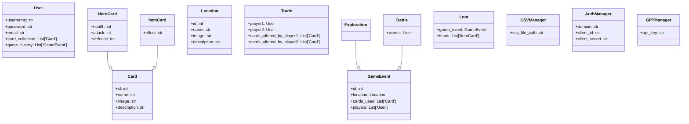

```mermaid
classDiagram
    class User {
        +username: str
        +password: str
        +email: str
        +card_collection: List['Card']
        +game_history: List['GameEvent']
    }
    class Card {
        +id: int
        +name: str
        +image: str
        +description: str
    }
    class HeroCard {
        +health: int
        +attack: int
        +defense: int
    }
    class ItemCard {
        +effect: str
    }
    class Location {
        +id: int
        +name: str
        +image: str
        +description: str
    }
    class Trade {
        +player1: User
        +player2: User
        +cards_offered_by_player1: List['Card']
        +cards_offered_by_player2: List['Card']
    }
    class GameEvent {
        +id: int
        +location: Location
        +cards_used: List['Card']
        +players: List['User']
    }
    class Exploration {
    }
    class Battle {
        +winner: User
    }
    class Loot {
        +game_event: GameEvent
        +items: List['ItemCard']
    }
    class CSVManager {
        +csv_file_path: str
    }
    class AuthManager {
        +domain: str
        +client_id: str
        +client_secret: str
    }
    class GPTManager {
        +api_key: str
    }
    HeroCard --|> Card
    ItemCard --|> Card
    Exploration --|> GameEvent
    Battle --|> GameEvent
```
This is a class diagram using mermaid.js in markdown format for the provided classes and attributes.